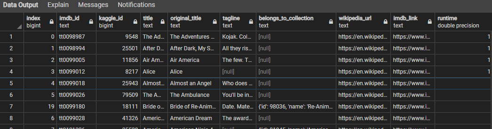

# Extract Transform Load (ETL) from Web Data

## Overview

This project moves through the entire life cycle of ETL. The project gathers raw data from Wikipedia, Kaggle and Movielens, combines them, and saves them into a Postgres SQL database so that it's available as a clean dataset for the end-user, The data chosen is a list of over 2000 movies with over 40 different columns. The movie specific data comes from Wikipedia and Kaggle and the rating data comes from MovieLens, which is an independent movie rating website. The Kaggle dataset pulls from the MovieLens dataset of over 20 million reviews and contains a metadata file with details about the movies.

## Data
The raw data consists of the three files below:
1. `movies_metadata.csv`: MovieLens is a website run by the GroupLens research group at the University of Minnesota. The Kaggle dataset pulls from the MovieLens dataset of over 20 million reviews and contains a metadata file with details about the movies from IMDB. 

2. `ratings.csv`: rating data from MovieLens on Kaggle.

3. `Wikipedia-movies.json`: Wikipedia has a ton of information about movies, including budgets and box office returns, cast and crew, production and distribution, and so much more. Wikipedia-movies.json is a compilation of records pulled from Wikipedia and formatted in JSON.

## ETL Process
The ETL process is encapsulated in  4 main files for the easy understanding of the viewer. Each of these files builds on the previous file providing more information to the reader. 

1. `ETL_function_test.ipynb`
The function in this file reads in the three data files ( Wikipedia, Kaggle and Movielens) and creates three separate data frames from them. The Kaggle and Movielens are in .csv format and the Wikipedia is in JSON format. 

2. `ETL_clean_wiki_movies.ipynb`
The function in this file is an extension of the file above and picks up after the files are read. This function cleans the Wikipedia data. The data is cleaned it the following way:
   - Select only the records from Wikipedia-movies.json that have 'imdb_link' and ('Director' or 'Directed by') keys and not 'No. of episodes'.
   - Combine titles in various languages into one single field.
   - Derive the 'imdb_id' from 'imdb_link' and use this as the primary key to de-duplicate records.
   - Drop fields that are 90% empty.
   - Convert the fields into appropriate data types using regular expressions.

3. `ETL_clean_kaggle_data.ipynb `
The function in this file is an extension of the file above and picks up after the Wikipedia data is cleaned. Then, the Kaggle metadata data frame is merged with the Wikipedia movies data frame to create the `movies_df` data frame. Finally, the MovieLens rating data frame is merged with the `movies_df` data frame to create the `movies_with_ratings_df`.
   - Remove the 'adults' films from the Kaggle data and convert fields into appropriate data types.
   - Merge the Wikipedia dataset with Kaggle data, select/update/drop fields that exist in both sets.
   - Get the count on the rating data by movieId and rating. Then pivot the group using movieId as Index, rating as column and the count as value.

4. `ETL_create_database.ipynb`
This file makes a copy of the `ETL_clean_kaggle_data.ipynb` file and adds the data to a Postgres database using SQLAlchemy. 

## Result
 The final  result is as follows :

&nbsp;

*Movies Data*

&nbsp;

*Ratings Data*
